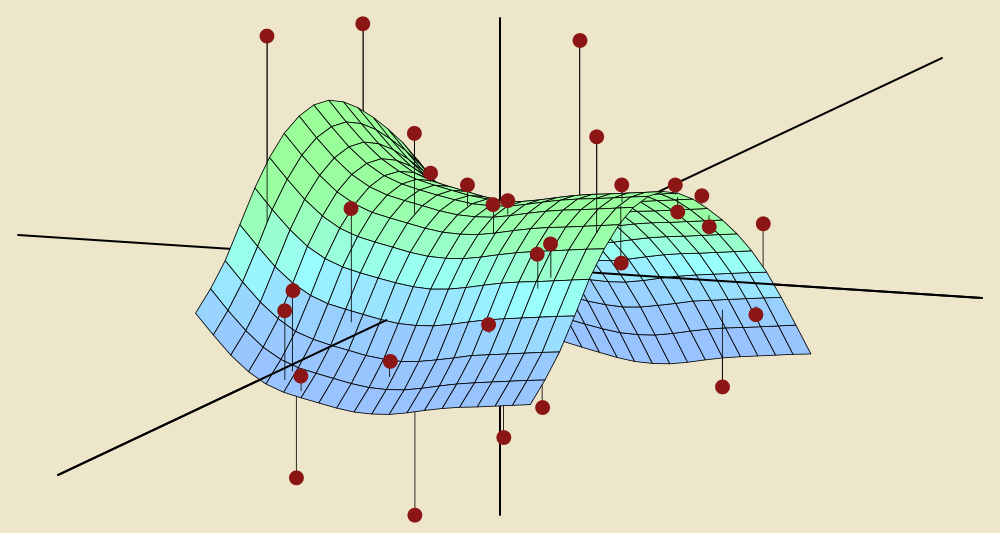

Statistical Learning Theory Working Group
====

This will be the webpage for the Statistical Learning Theory working group. Updates will be posted here as and when they come. 

| Time     	    | Wednesdays 2:00 - 3:00 PM 	|
|----------	    |---------------------------	|
| **Location** 	| **Thomas 327**               	|

Members
----
* *Faculty*
	* [Dr. Bharath Sriperumbudur](http://personal.psu.edu/bks18/)

* *Students*
	* [Nicholas Sterge](https://stat.psu.edu/people/nzs5368)
	* [Nikolas Siapoutis](https://stat.psu.edu/people/nzs30)
	* [Omar Hagrass](https://stat.psu.edu/people/oih3)
	* [Siddharth Vishwanath](http://www.personal.psu.edu/txs514/)
	* [Tianhong Sheng](https://sidv23.github.io/)

Schedule
----

The schedule is also available on the [STAG Google Calendar](https://calendar.google.com/calendar?cid=dDNqbXA3MWcyZ2Uya241NGtoN2FmbDM1dWdAZ3JvdXAuY2FsZW5kYXIuZ29vZ2xlLmNvbQ)

| Date     	    | Speaker     | Topic          |
|----------	    |----------   |----------------|
| Aug 28, 2019 	|     XXX     | GANs : 
[Foundations](https://papers.nips.cc/paper/5423-generative-adversarial-nets.pdf), [Theory](https://arxiv.org/abs/1803.07819)  |
| Sep  4, 2019 	|     XXX     | Convolutional Neural Networks            |
| Sep 11, 2019 	|     XXX     | Recurrent Neural Networks                |
| Sep 18, 2019 	|     XXX     |  Wasserstein GANs                        |

Contact
----

If you're interested in attending the meetings, please [sign-up here](https://forms.gle/xFZGmoPqh75gaj4X6) to be on the mailing list.

